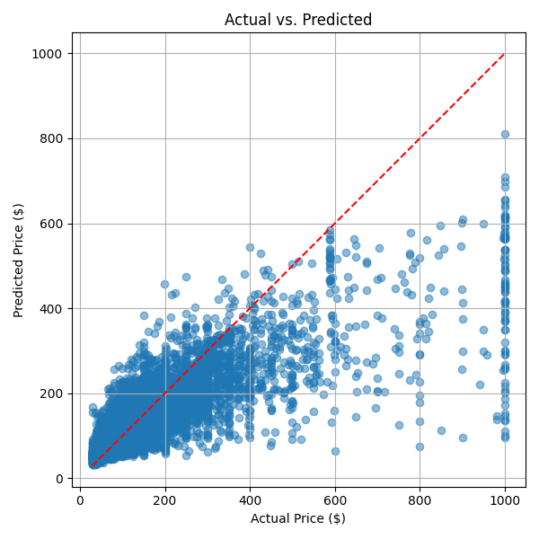
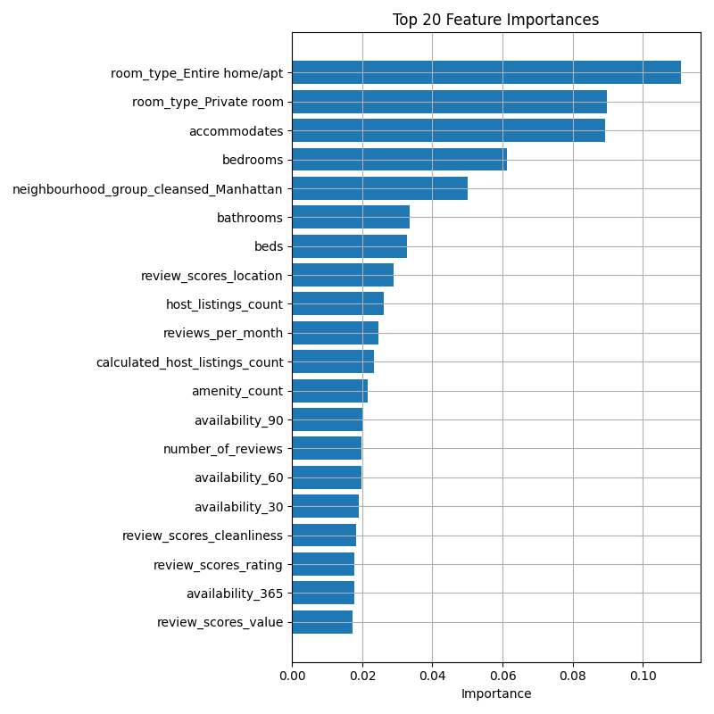
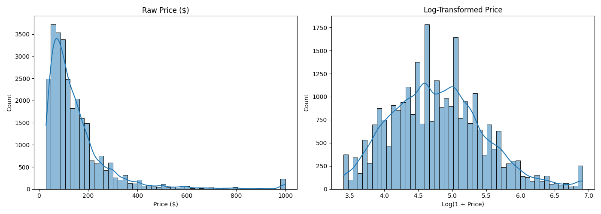
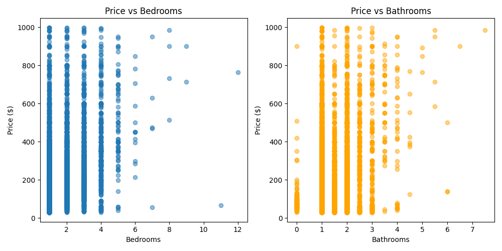
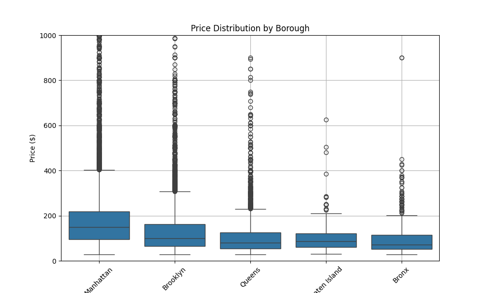
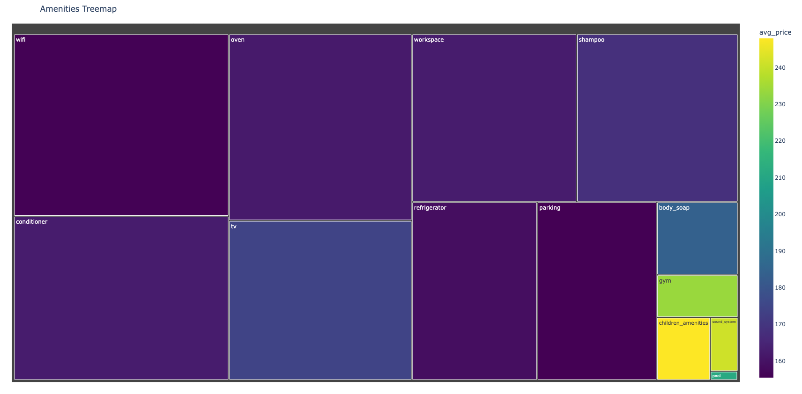
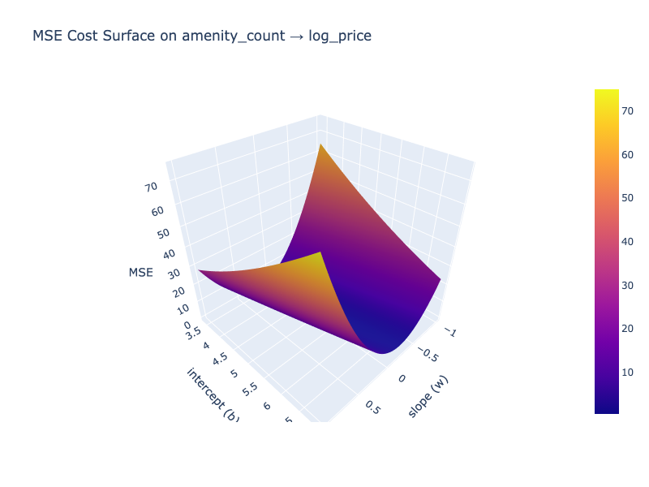
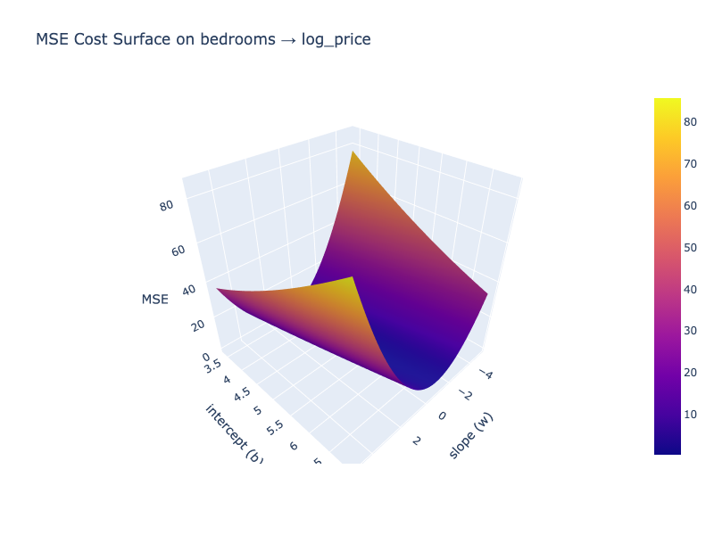
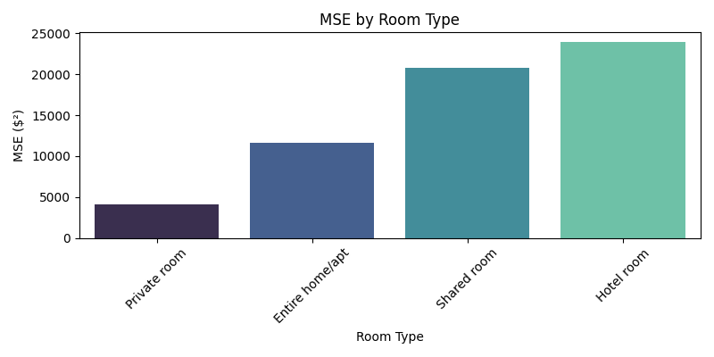
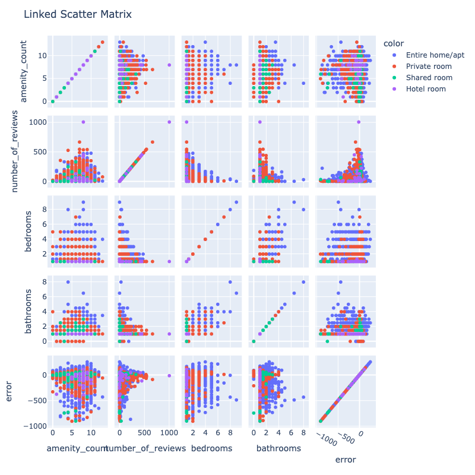

# Airbnb Price Prediction

## How to Build and Run the Code

This project uses a Makefile to install dependencies, run the model, and generate visualizations.

First, make sure you have Python installed. For this project we used, Python 3.9.9
  ``` bash
  brew install python@3.9.9
  ```

1. Clone the repository.
   ``` bash
   git clone git@github.com:winsondong/506-final-project.git
   ```
2. Navigate into the project folder
   ``` bash
   cd 506-final-project
   ```
3. Create and activate a virtual environment:
   ``` bash
   python3 -m venv venv
   source venv/bin/activate  # Mac/Linux
   venv\Scripts\activate     # Windows
   ```
5. Run the Makefile to install dependencies, train the model, and generate visualizations:
    ```bash
    make all
    ```

This will:
- Install all dependencies listed in `requirements.txt`
- Run the Random Forest model (`Final_project_RandomForest.py`)
- Generate plots (`visualizing.py`)

## Individual Commands

You can also run tasks separately:

- Install dependencies:
    ```bash
    make install
    ```

- Run the model:
    ```bash
    make run
    ```

- Regenerate visualizations:
    ```bash
    make visualize
    ```

- Clean up Python cache files:
    ```bash
    make clean
    ```


---

### How to Test the Code

This project uses the output metrics (MSE, RMSE, R²) and visual validation to evaluate prediction performance.

You can regenerate results and visualizations at any time:

```bash
make run         # Re-runs model training
make visualize   # Re-renders visualizations
pytest test_airbnb.py --verbose #To test our written tests
```

For cleanup:

```bash
make clean
```


## Project Structure

- `Final_project_RandomForest.py` — Code to train and evaluate the Random Forest model.
- `visualizing.py` — Code to generate visualizations of the results.
- `requirements.txt` — Python dependencies.
- `Makefile` — Automation for building, running, and cleaning the project.


## 📽️ Video Presentation

Watch the YouTube video by clicking on the image below or through this link: https://youtu.be/i0HKWSJIwBM
- Slides are available here: https://docs.google.com/presentation/d/19pi1JXoRr79x2JrkvQs2HIOteJBz0OEifqQLZt1Y-Ck/edit?usp=sharing

[](https://youtu.be/i0HKWSJIwBM)


## Project Proposal, Description, and Goals:

### Project Proposal
- **Title:** Predicting Airbnb Prices in NYC

### Project Description
This project aims to predict Airbnb listing prices in New York City based on various features such as:

- Location (borough, neighborhood, zip code)
- Number of bedrooms
- Number of bathrooms
- Floor number
- Type of property
- Other relevant attributes

By analyzing a dataset of Airbnb listings, we seek to:

- Identify key factors influencing price variations.
- Develop a model capable of making accurate price predictions.

### Project Goals
- Develop a machine learning model capable of accurately predicting the price of an Airbnb listing given specific features.
- Identify the most significant features that influence Airbnb pricing in NYC.
- Provide insights into pricing strategies for hosts and renters based on location and property characteristics.


## Data Collection:

The dataset used for this project contains detailed information about Airbnb listings in New York City. It was sourced from publicly available Airbnb data and includes a wide range of features that describe both the property itself and its host.

### Key Categories of Data:

- **Property Features:**
  - `bedrooms`, `bathrooms`, `accommodates`, `beds`
  - `property_type`, `room_type`, `floor`
  - `square_feet`, `minimum_nights`, `maximum_nights`
  
- **Location Information:**
  - `borough`, `neighborhood`, `latitude`, `longitude`, `zipcode`
  - Geographical features allow analysis of spatial price variation across NYC.

- **Host Characteristics:**
  - `host_id`, `host_name`, `host_is_superhost`
  - `host_listings_count`, `host_response_rate`, `host_since`
  - These features provide insight into how host professionalism might affect pricing.

- **Listing Details and Amenities:**
  - `name`, `description`, `amenities`
  - Amenities are provided as a free-form text field and required significant processing to extract useful structured features (e.g., presence of WiFi, TV, Air Conditioning).

- **Reviews and Ratings:**
  - `review_scores_rating`, `number_of_reviews`, `reviews_per_month`
  - Help capture the quality and popularity of the listing.

- **Pricing Information:**
  - `price`, `security_deposit`, `cleaning_fee`, `extra_people`
  - The `price` is the target variable we aim to predict.

## Data Processing

The dataset used in this project was compiled from multiple publicly accessible sources. Because it was a combination of different datasets, extensive preprocessing was necessary before the data could be used for model training.

### Handling Missing Values
The first step in preprocessing involved managing missing values. The dataset contained both numerical and categorical columns, each requiring a different approach. For numerical features, missing values were replaced with the mean of the respective column to minimize distortion of the data. For categorical features, rows with missing values were removed entirely, as imputing these fields without reliable information could introduce bias. In addition to handling missing values, we dropped several columns deemed irrelevant or redundant for modeling, including `host_has_profile_pic`, `calculated_host_listings_count_private_rooms`, and `n_host_verifications`, as they offered little predictive value and would have introduced noise.

### Encoding Categorical Data
Categorical variables needed to be transformed into numerical formats for model compatibility. One of the most challenging columns was `amenities`, which contained free-form text listing the available amenities for each listing. Given the variability in formatting (e.g., "TV with HBOMax" vs. "HD TV with streaming services"), traditional label encoding was unsuitable. To address this, we generated a frequency distribution of the top 20 most common words across all entries, selected 15 distinct high-frequency amenities likely to influence price, and created binary indicator columns (such as `wifi`, `tv`, `shampoo`) to represent the presence or absence of these amenities.

### Standardizing Location Data
The `neighborhood_group` column presented challenges due to inconsistencies in naming conventions and granularity. After applying label encoding, we observed overlaps and inconsistencies among neighborhood names. To mitigate this, we standardized the values using a normalization function similar to the one applied to the amenities. The cleaned location data was then one-hot encoded to prepare it for input into the machine learning models.

---

## Data Modeling

Our goal was to predict Airbnb listing price based on a rich set of host, property, location, and review features. To find the best predictive model for this dataset, we tested three regression approaches: Linear Regression, Decision Tree Regression, and Random Forest Regression.

We started with Decision Tree Regression, which splits the data based on feature values to minimize prediction errors. While tuning hyperparameters such as max_depth and min_samples_split, we observed that the decision tree tended to overfit the training data, achieving an MSE of around 11,000. This poor generalization made it unsuitable for our dataset, where factors like location, room type, and amenities interact in complex, non-linear ways.

We then tested Linear Regression, a simple model that assumes a purely linear relationship between features and price. Although Linear Regression reduced the MSE to around 7,000 compared to Decision Trees, it struggled with our dataset’s non-linear relationships—such as how a penthouse in Manhattan and a studio in Brooklyn might have wildly different pricing patterns even if some features seem similar numerically.

Finally, we implemented Random Forest Regression, an ensemble method that constructs multiple decision trees on different subsets of the data and averages their outputs. Using hyperparameters such as n_estimators=200, max_depth=None, and max_features='sqrt', the Random Forest model achieved an MSE of approximately 0.136 and an R² score of about 0.71. This strong performance demonstrated its ability to model the complex interactions in our dataset.

Random Forest was particularly well-suited for our Airbnb listings dataset for several reasons:

- Capturing complex patterns: Listing prices in New York City are influenced by a wide range of interacting features—like room type, location, availability, and review scores—which Random Forest can model effectively without requiring manual interaction terms.

- Robustness to noise: Our dataset includes messy or missing data (e.g., incomplete reviews, missing descriptions). Random Forest handles such inconsistencies better than single models like Decision Trees or Linear Regression.

- Handling a mix of feature types: The dataset includes a combination of numerical features (e.g., beds, accommodates) and categorical features (e.g., room_type, neighbourhood_group_cleansed). Random Forests naturally manage this variety with minimal preprocessing.

- Feature importance for insights: Random Forest provides built-in feature importance scores, helping us identify key drivers of price such as the number of beds, review ratings, availability, and property type, offering actionable insights for both hosts and platform managers.

- Scalability: Given the dataset size (~28,000 rows), Random Forest’s parallelization abilities helped maintain reasonable training times without sacrificing performance.

- Minimal hyperparameter sensitivity: Unlike more sensitive models like Gradient Boosting Machines, Random Forest achieved strong results with straightforward hyperparameter tuning, making it efficient during the model selection phase.

Given these strengths—and the superior evaluation results—we chose Random Forest Regression as the final model to refine and optimize for our Airbnb price prediction task.


---

## Results

To evaluate model performance, we primarily used the Mean Squared Error (MSE) and Root Mean Squared Error (RMSE) metrics. MSE measures the average squared difference between predicted and actual values, penalizing larger errors more heavily. Our goal was to minimize the MSE, ideally to a value close to zero. RMSE, the square root of MSE, provides an interpretable metric in the same units as the target variable (price), making it easier to assess prediction quality.


For our final Random Forest model, we achieved:
- **MSE:** 0.136
- **RMSE:** 0.368


These results indicate strong predictive performance.  
We also evaluated the model using the R² score, which measures the proportion of variance in the target variable explained by the model. The Random Forest Regression model achieved an R² score of approximately 0.71, meaning it was able to explain around 71% of the variability in listing prices. 


### Actual Price vs Predicted Price - A scatterplot of each listings actual price vs our models predicted price.

  - Observations: We see that the most dense area of the graph is where price < $400 meaning most listings remain in that range. We also note that this is the range where our predictions were most accurate, with a roughly equivalent number of listings being under or over predicted.
From $400 to $1000, we see that almost every single listing was underpredicted. 


---
## Visualizing the data: 


---
### Top 20 Feature Importances - Bar chart of the top 20 features sorted by the Random Forest’s built-in importance.

  - Observations: This graphs shows us the top 20 features that our model relies on the most. Entire home/apt and Private room are the features that had the strongest impact on our predictions. Understanding this ranking helped guide further feature engineering.

---
### Price Distribution - Raw price distribution histogram vs Log transformed price distribution.

  - Observations: We knew that raw prices would be heavily skewed to the right due to the nature of AirBnb prices. Therefore, we had decided that log transforming the price would be necessary in order to have a more normalized distribution of prices. We see after the transformation that the distribution is much more bell shaped as we were hoping. 


---
### Bar Chart - Highlight key features affecting price.


---
### Scatter Plot - Compare price vs. bedrooms/bathrooms.
 


---
### Heatmap - Show feature correlations.


---
### Map Plot - Visualize prices across NYC neighborhoods.
 


---
### Amenities Tree Map - Tree map of our normalized amenities.

  - Observations: We see 13 amenities that are the most prevalent; the most notable ones being wifi, oven, conditioner, shampoo, oven, and workspace. Niche amenities like gym, children_amenities, and sound_system have smaller blocks (meaning lower prevalence) but noticeably higher average prices, suggesting strong impact on value. 


---
### MSE Amenities - An interactive 3-dimensional surface of our MSE on amenity_count.

  - Observations: This interactive plot shows how sensitive the error is to a given w/b when modeling just one feature. We see that our MSE is lowest and most optimal where the value of w ranges from -0.2 to 0.2. The absolute lowest point of MSE on the graph is where b is about 3.5 which tells us that tells us that our baseline price is about $32/night if no amenities are counted. Combined with a broad/flat shape in b, this confirms that amenity_count alone has a weak impact on our predictions. Even a model that completely ignores amenity_count can perform almost just as well. This allows us to conclude that the baseline price is almost always more impactful than any unique amenities offered.


---
### MSE Bedrooms - An interactive 3-dimensional surface of our MSE on bedrooms.

  - Observations: On initial glance, this graph looks almost identical to the Amenities MSE graph. The graph also has a broad/flat shape in b while the deepest part of the bowl/ridge in the graph is when w ranges from 0 to -1. Like the amenity_count, bedrooms is not a strong independent feature in our model; and the baseline price is almost always more impactful. An interesting thing to note after observing this graph, however, is the fact that although bedrooms may not be a strong feature on its own, the fact that it is our 4th most important feature indicates that it is imperative when it comes to our models prediction. It becomes critical when interacting with other features during training and predictions, as it is able to provide strong indications such that groupings are tighter and more accurate.


---
### MSE Roomtypes - A bar chart showing the Mean Squared Error (dollars²) of our model’s predictions, grouped by room_type.

  - Observations: Private rooms have the lowest MSE. This means that our model predicts those most accurately. Entire home/apartments is next most accurate, then shared rooms, and finally hotel rooms. Hotel rooms have the highest MSE, indicating our model is least reliable there.

---
### Linked Scatter Matrix - linked scatter‐matrix showing every pairwise scatter plot with points colored by room_type.

 - Notable observations:
  - Number of Reviews vs. Amenity Count: Although there is no strong notable linear pattern, we are able to observe that the highest number of reviews is when the amenity count is around 5 to 7. Overall, we see that listings with a lot of amenities often cluster at moderate review counts. 
  - ERROR: Comparing with error gives us detailed insight on which features struggle the most.
    - Error vs. Amenity Count: Out of the 4 chosen features in this matrix, we can see that amenity count has the highest variance in error. The graph is the most scattered compared to the other 3, and least predictable. This indicates that our model not only underpredicts drastically for listings with a lot of amenities (the most drastic being from range 5 to 8), but also struggles with amenities in general (although not so much only when amenity count is around 0~2).
    - Error vs. Number of Reviews: When number of reviews is close to 0, we have the greatest variance in error (over/underpredictions). When the number of reviews exceeds 500, we have the least variance in error, as the points skew. The skew of the graph, combined with our mentioned observations, allows us to state that the more reviews a listing has, the closer we get to 0 error -- smaller range of over/under-predictions.
    - Error vs. Bedrooms/Bathrooms: There is no strong noticeable pattern. What we can observe, however, is that overall, listings with more bathrooms tend to have slightly less drastic underpredictions.

## Presentation:
"CS506 Final Project.mp4"
or 
https://youtu.be/i0HKWSJIwBM


---

## Supported Environments

- **Python Version:** 3.9.9  
- **Operating Systems:** macOS, Linux, Windows  
- **Libraries:** See `requirements.txt` for:
  - pandas, numpy, sklearn, matplotlib, seaborn, etc.


## How to Contribute

1. Fork the repository  
2. Create a new branch:  
   ```bash
   git checkout -b feature-name
   ```
3. Make your changes  
4. Commit with a clear message:  
   ```bash
   git commit -m "Add feature"
   ```
5. Push and create a Pull Request

