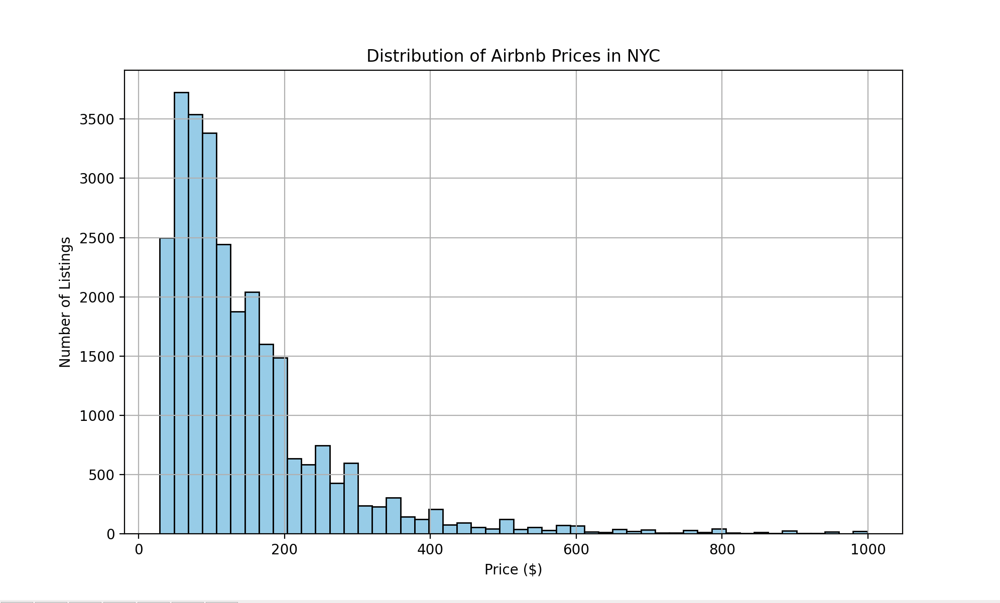

# 506-final-project

Video Presentation:
 - https://www.youtube.com/watch?v=lRojpqXUKZg

## Project Proposal, Description, and Goals:

### Project Proposal
- **Title:** Predicting Airbnb Prices in NYC

### Project Description
This project aims to predict Airbnb listing prices in New York City based on various features such as:

- Location (borough, neighborhood, zip code)
- Number of bedrooms
- Number of bathrooms
- Floor number
- Type of property
- Other relevant attributes

By analyzing a dataset of Airbnb listings, we seek to:

- Identify key factors influencing price variations.
- Develop a model capable of making accurate price predictions.

### Project Goals
- Develop a machine learning model capable of accurately predicting the price of an Airbnb listing given specific features.
- Identify the most significant features that influence Airbnb pricing in NYC.
- Provide insights into pricing strategies for hosts and renters based on location and property characteristics.

## Data Collection:

The dataset used for this project contains detailed information about Airbnb listings in New York City. It was sourced from publicly available Airbnb data and includes a wide range of features that describe both the property itself and its host.

### Key Categories of Data:

- **Property Features:**
  - `bedrooms`, `bathrooms`, `accommodates`, `beds`
  - `property_type`, `room_type`, `floor`
  - `square_feet`, `minimum_nights`, `maximum_nights`
  
- **Location Information:**
  - `borough`, `neighborhood`, `latitude`, `longitude`, `zipcode`
  - Geographical features allow analysis of spatial price variation across NYC.

- **Host Characteristics:**
  - `host_id`, `host_name`, `host_is_superhost`
  - `host_listings_count`, `host_response_rate`, `host_since`
  - These features provide insight into how host professionalism might affect pricing.

- **Listing Details and Amenities:**
  - `name`, `description`, `amenities`
  - Amenities are provided as a free-form text field and required significant processing to extract useful structured features (e.g., presence of WiFi, TV, Air Conditioning).

- **Reviews and Ratings:**
  - `review_scores_rating`, `number_of_reviews`, `reviews_per_month`
  - Help capture the quality and popularity of the listing.

- **Pricing Information:**
  - `price`, `security_deposit`, `cleaning_fee`, `extra_people`
  - The `price` is the target variable we aim to predict.

## Initial Modeling Phase

During the initial modeling phase, we experimented with several different regression techniques to predict Airbnb prices, including Linear Regression, Decision Tree Regression, and Random Forest Regression. Linear Regression served as a simple baseline model, assuming a purely linear relationship between the features and the price. Decision Tree Regression introduced non-linearity by recursively splitting the data based on feature values to minimize prediction errors. Finally, Random Forest Regression, an ensemble method that builds and averages multiple decision trees, was tested to improve predictive accuracy and model robustness.

Random Forest Regression was the best-performing model based on evaluation metrics like Mean Squared Error (MSE) and R² score. We chose to focus on Random Forest for several important reasons. First, Random Forest can naturally capture complex, non-linear relationships between features and target variables without requiring explicit transformations, giving it a major advantage over simple Linear Regression. Second, because it averages predictions across many different decision trees, Random Forest is more robust against overfitting compared to a single Decision Tree model, which can easily become overly specialized to the training data.

Another major benefit of Random Forest is that it provides built-in measures of feature importance, helping us interpret which features—such as location, number of bedrooms, or available amenities—have the greatest impact on pricing. This interpretability was important not only for building a good model but also for drawing practical insights for hosts and renters. Additionally, Random Forest handles both numerical and categorical features well after basic encoding and is relatively stable compared to more sensitive models like Gradient Boosting Machines. It does not require intensive hyperparameter tuning to achieve good performance, making it an ideal choice during the early stages of modeling. Furthermore, Random Forest is scalable, capable of parallelizing training across multiple CPU cores, which makes it suitable for handling a dataset of this size.

Based on these advantages and early experiments, where Random Forest achieved a lower MSE and a higher R² score than both Linear Regression and Decision Tree Regression, we decided to continue refining and optimizing the Random Forest model for our final evaluation phase.

## Data Processing

The dataset used in this project was compiled from multiple publicly accessible sources. Because it was a combination of different datasets, extensive preprocessing was necessary before the data could be used for model training.

### Handling Missing Values
The first step in preprocessing involved managing missing values. The dataset contained both numerical and categorical columns, each requiring a different approach. For numerical features, missing values were replaced with the mean of the respective column to minimize distortion of the data. For categorical features, rows with missing values were removed entirely, as imputing these fields without reliable information could introduce bias. In addition to handling missing values, we dropped several columns deemed irrelevant or redundant for modeling, including `host_has_profile_pic`, `calculated_host_listings_count_private_rooms`, and `n_host_verifications`, as they offered little predictive value and would have introduced noise.

### Encoding Categorical Data
Categorical variables needed to be transformed into numerical formats for model compatibility. One of the most challenging columns was `amenities`, which contained free-form text listing the available amenities for each listing. Given the variability in formatting (e.g., "TV with HBOMax" vs. "HD TV with streaming services"), traditional label encoding was unsuitable. To address this, we generated a frequency distribution of the top 20 most common words across all entries, selected 15 distinct high-frequency amenities likely to influence price, and created binary indicator columns (such as `wifi`, `tv`, `shampoo`) to represent the presence or absence of these amenities.

### Standardizing Location Data
The `neighborhood_group` column presented challenges due to inconsistencies in naming conventions and granularity. After applying label encoding, we observed overlaps and inconsistencies among neighborhood names. To mitigate this, we standardized the values using a normalization function similar to the one applied to the amenities. The cleaned location data was then one-hot encoded to prepare it for input into the machine learning models.

---

## Data Modeling

For modeling, we decided to explore multiple approaches to predict the target variable, `price`, based on the available features. We tested three different regression methods to determine which would perform the best.

We first implemented Decision Tree Regression, which recursively splits the data based on feature values to minimize the Mean Squared Error (MSE). Each split was made with the goal of achieving the lowest possible MSE, and splits continued until stopping criteria were met. For this model, we tuned parameters such as `max_depth` ([3, 5, 7, 10, None]) and `min_samples_split` ([2, 5, 10]). However, the decision tree model yielded an MSE of around 11,000, indicating poor generalization and suboptimal performance.

Next, we tested a Linear Regression model, which fits a straight line to minimize the MSE between predicted and actual values. This approach improved results compared to the decision tree, with an MSE of approximately 7,000. However, it still struggled to capture the non-linear relationships present in the data.

Finally, we implemented a Random Forest Regressor, an ensemble method that constructs multiple decision trees using different subsets of the training data and averages their outputs to improve performance. This approach mitigates overfitting and captures complex patterns more effectively. The hyperparameters we used included `n_estimators=200`, `max_depth=None`, `min_samples_leaf=1`, `max_features='sqrt'`, and `min_samples_split=2`. The Random Forest model significantly outperformed the others, achieving an MSE of approximately 0.136 and an R² score of about 0.71, suggesting that the model explained 71% of the variance in Airbnb listing prices.

---

## Results

To evaluate model performance, we primarily used the Mean Squared Error (MSE) and Root Mean Squared Error (RMSE) metrics. MSE measures the average squared difference between predicted and actual values, penalizing larger errors more heavily. Our goal was to minimize the MSE, ideally to a value close to zero. RMSE, the square root of MSE, provides an interpretable metric in the same units as the target variable (price), making it easier to assess prediction quality.

For our final Random Forest model, we achieved:
- **MSE:** 0.136
- **RMSE:** 0.368

These results indicate strong predictive performance.  
We also evaluated the model using the R² score, which measures the proportion of variance in the target variable explained by the model. The Random Forest Regression model achieved an R² score of approximately 0.71, meaning it was able to explain around 71% of the variability in

Visualizing the data: 
 - Histogram - Show price distribution.
    

 - Scatter Plot - Compare price vs. bedrooms/bathrooms.
 

 - Heatmap - Show feature correlations.

 - Map Plot - Visualize prices across NYC neighborhoods.
 

 - Bar Chart - Highlight key features affecting price.

