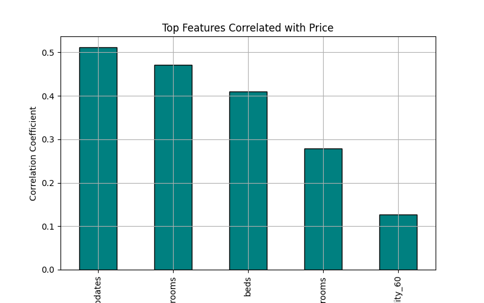

# 506-final-project

Project Proposal: 
 - Predicting Airbnb Prices in NYC

Project Description: 
 - This project aims to predict Airbnb listing prices in New York City based on various features such as location, number of bedrooms, number of bathrooms, floor number, and other relevant attributes. By analyzing a dataset of Airbnb listings, we seek to identify key factors influencing price variations and develop a model to make accurate price predictions.

Project Goal(s):
 - Develop a machine learning model capable of accurately predicting the price of an Airbnb listing given specific features.

 - Identify the most significant features that influence Airbnb pricing in NYC.

 - Provide insights into pricing strategies for hosts and renters based on location and property characteristics.

Data Collection:
 - The dataset will be sourced from publicly available Airbnb listings data, such as the Inside Airbnb dataset (http://insideairbnb.com/) or we have found a dataset called airbnbdata.csv online.

 - The dataset contains features including but not limited to:
    - Number of bedrooms
    - Number of bathrooms
    - Location (borough, neighborhood, zip code)
    - Floor number (if available)
    - Type of property (apartment, house, shared room, etc.)
    - Host details (superhost status, number of listings managed)
    - Reviews and ratings

Modeling data:
 - Decision Tree Regressor

Visualizing the data: 
 - Histogram - Show price distribution.
    

 - Scatter Plot - Compare price vs. bedrooms/bathrooms.
 

 - Heatmap - Show feature correlations.

 - Map Plot - Visualize prices across NYC neighborhoods.
 

 - Bar Chart - Highlight key features affecting price.

Test Plan:
 - Split the dataset into training (70%), validation (10%), and testing (20%) sets.
 - Apply k-fold cross-validation to ensure model robustness.
 - Compare model performance using metrics like RMSE (Root Mean Squared Error), MAE (Mean Absolute Error), and R-squared.

